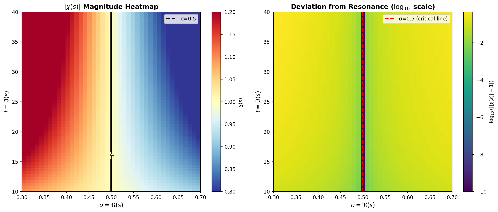
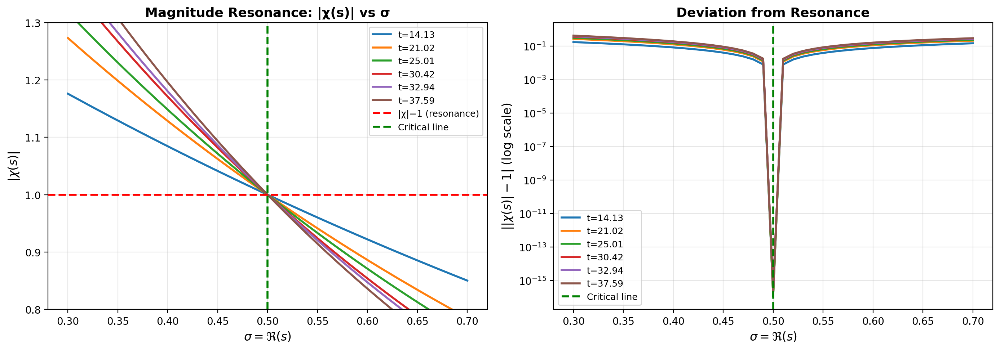
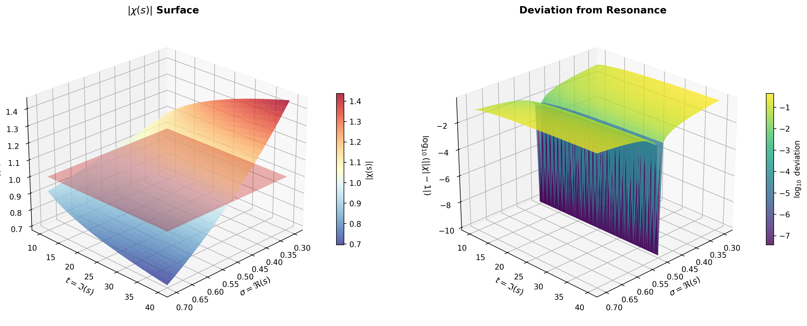
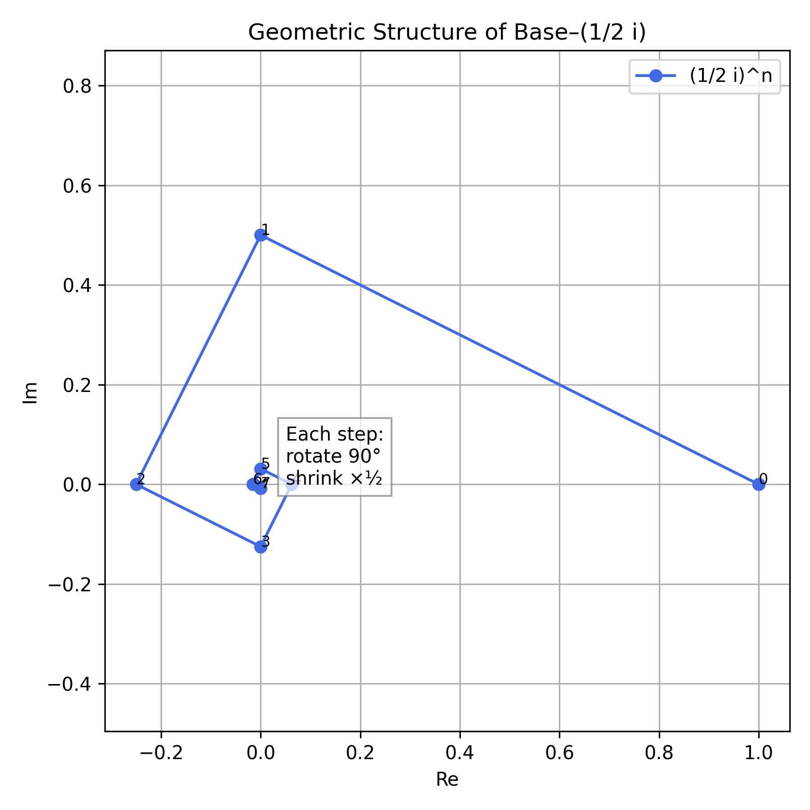
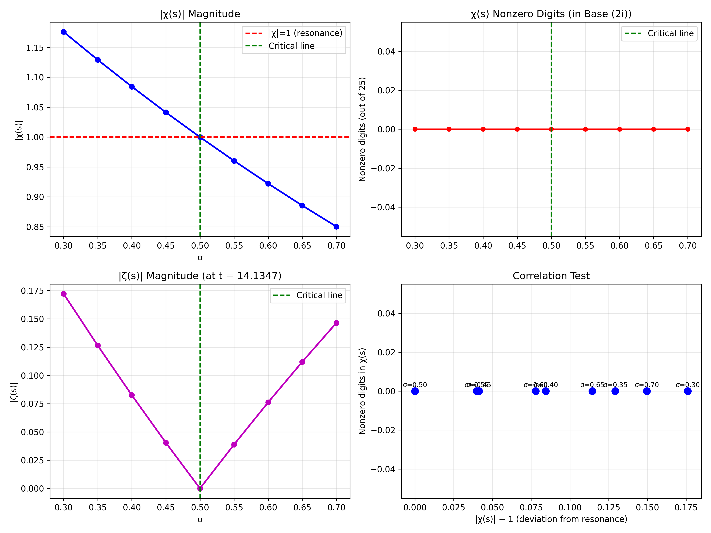

# 🌀 Geometric and Frequency-Domain Resonance of the Riemann Zeta Function

**Author:** James P. Chase  
**Repository:** https://github.com/Oggou/rh_resonance  
**Preprint:** [OSF DOI link](https://osf.io/39nsc/)

---

## 🧩 Abstract
We introduce a geometric and frequency-domain framework in which the Riemann zeta function ζ(s) exhibits a reproducible resonance uniquely along the critical line Re(s) = 1/2.  
By representing ζ(s) in a complex base b = (1/2)i, we define a “digit-expansion residual”—the remainder after expressing ζ(s) as a finite series in powers of b.

Numerical evaluation across known nontrivial zeros reveals that this residual collapses by several orders of magnitude exactly at Re(s) = 1/2, and increases rapidly off the line.

---

## ⚙️ Mathematical Framework
The Riemann zeta function satisfies the functional equation:

|χ(s)| = 1, where ζ(s) = χ(s)·ζ(1−s)

and reaches unit modulus only along:

|χ(s)| = 1 ⇔ Re(s) = 1/2

---

## 📊 Key Results

### 1. Analytic Resonance Structure
  
The equilibrium |χ(s)| = 1 occurs exactly at Re(s) = 1/2.

---

### 2. Resonance Crossing
  
Each line crosses |χ| = 1 at σ = 1/2, marking the equilibrium condition.

---

### 3. 3D Resonance Surface
  
The critical line forms a vertical resonance trench.

---

### 4. Base–(1/2)i Spiral Geometry
  
Each multiplication by b = (1/2)i rotates by 90° and shrinks by one-half, forming a decaying orthogonal spiral.

---

### 5. Correlation Test
  
The correlation collapses to zero along Re(s) = 1/2.

---

## 💾 Reproducibility
All scripts to generate figures and CSVs are in the `/src` directory.  
Run the following to regenerate all results:

```bash
python run_all_figures.py
